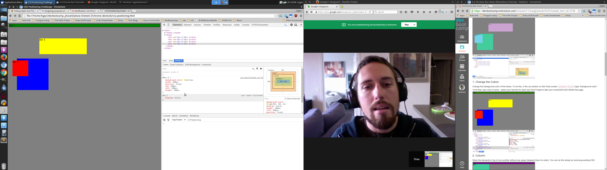
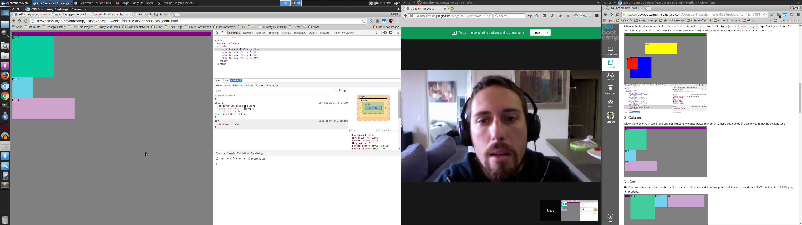
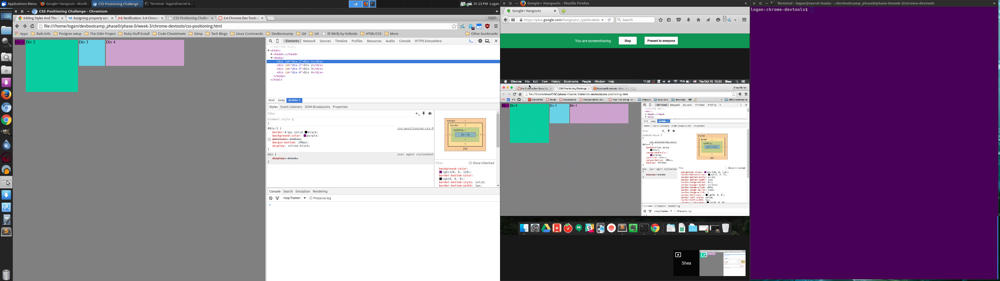
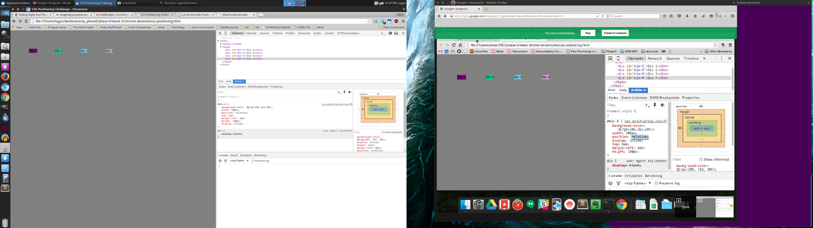
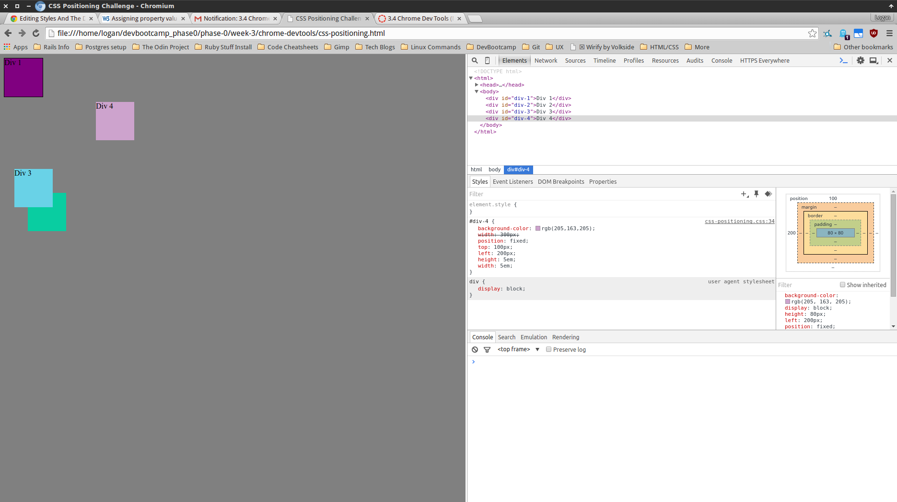
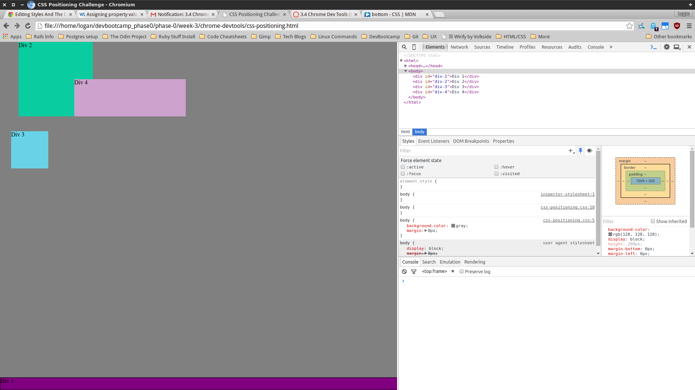
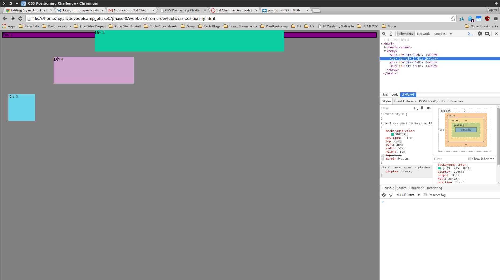
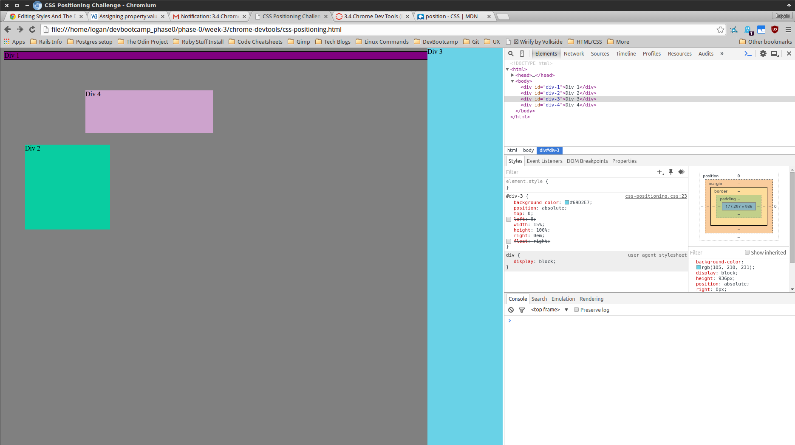
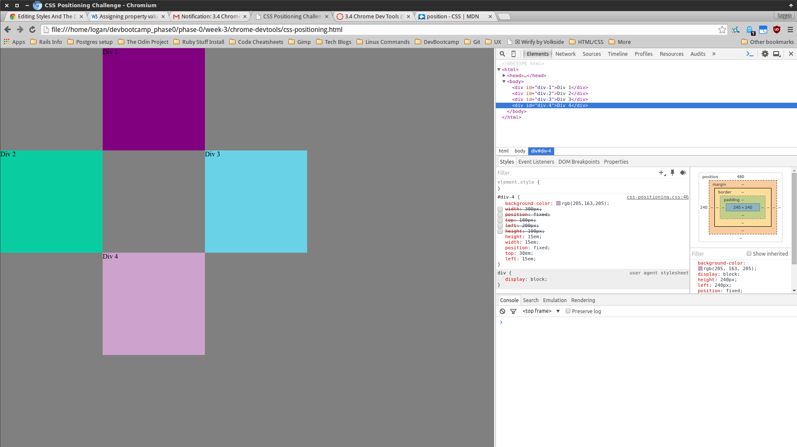

***How can you use Chrome's DevTools inspector to help you format or position elements?***
There are so many different options chrome devtools provides. I will specifically 
mention the margin border grid thingy, it's helpful to quickly see what kind of
spacing is being used on a specific element. Also, I love the color picker, it's 
great you can just quickly update a color through the tools.

***How can you resize elements on the DOM using CSS?***
You can type in different measurements to adjust your elements with the CSS tool, 
like height and width.

***What are the differences between Absolute, Fixed, Static, and Relative positioning? Which did you find easiest to use? Which was most difficult?***
Fixed, keeps an element fixed in place, it will not adjust according to screen 
size. It also stays in place when scrolling. Absolute, is a lot like fixed but 
when you scroll your screen it will disappear if you move far enough. Static, 
uses normal behavior and stays in it's position in the flow. Basically, to me,
 that means I can't adjust it's position with top, right, left, or bottom. 
 Relative, is relative to the other elements and the screen.

I'm not entirely comfortable with them yet. I will have to do more practice, but
with this challenge fixed was the easiest because it did not move.

***What are the differences between Margin, Border, and Padding?***
Margin, is like the invisible space on the outside of the element, it is part of
the element but it has no visible aspect. Border, is the line that will surround 
the padding and content of the element but inside the margin. Padding, is the 
space between the actual content of the element, like text, and the border. I 
think of padding as the inner margin.

***What was your impression of this challenge overall? (love, hate, and why?)***
I liked it because I needed serious practice on positioning and spacing....but I 
still need more!
