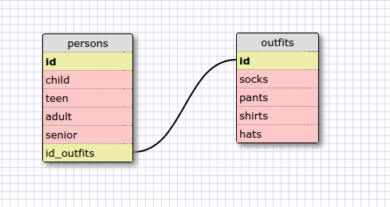

1. select * from states;

2. select * from regions;

3. select state_name, population from states;

4. select state_name, population from states order by population desc;

5. select state_name from states where region_id in ('7');

6. SELECT state_name, population_density
	FROM states
	WHERE population_density >= '50'
	ORDER BY population_density asc;

7. select state_name
	from states
	where population >='1000000' and population <='1500000';

8. select state_name, region_id
	from states
	order by region_id asc;

9. select region_name
	from regions
	where region_name
	like '%central%';

10a. select region_name, state_name
	 from regions, states
	 order by region_id asc;

10b. select regions.region_name, states.state_name
	 from regions
	 inner join states
	 order by region_id asc;

***What are databases for?***
A database is a convenient way to store lots of information. You can 
store a certain amount on a website but eventually there will be too
much information it will slow it down. A separate database is 
formated in a way that is easy to communicate with and access info.

***What is a one-to-many relationship?***
It means that a parent element can have many child element references.
Think of a family tree. The parent element usually wont have the same 
info that the child element holds. The child element can reference back
to the parent.

***What is a primary key? What is a foreign key? How can you determine which is which?***
A primary key is a key in a table that is unique. There can only be one
primary table. A foreign key is a primary keys representation from another
table. If I have two tables, cat and dog, my primary key in cat is called 
id_cat and within this cat table I have a field called id_dog which is
the dog table's primary key representation.  

***How can you select information out of a SQL database? What are some general guidelines for that?***
There are a ton of key words like "select" that will allow you to access
different fields and values. You can specify a value or use the * to get
everything within your parameters.
