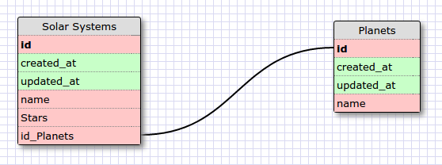
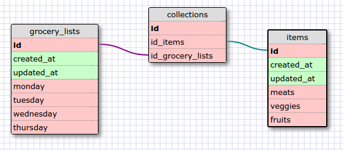

***What is a one-to-one database?***
When you would have two tables that have an exclusive relationship with
each other. I good example would be a table full of people and another 
table full of addresses. In this case only one person can be linked to one
address and vice versa. One to one's don't normally happen with databases.

***When would you use a one-to-one database? (Think generally, not in terms of the example you created).***
When information is exclusive with one other piece. I suppose if there was
some kind of sensitive information that was linked to one other identifier
it might be good to have a one to one relationship.

***What is a many-to-many database?***
When the same information is applied to multiple different tables. A good 
example would be food orders. An order can contain lots of food items but
those food items can be inside lots of orders.

***When would you use a many-to-many database? (Think generally, not in terms of the example you created).***
When there is a ton of stuff to track? Most things in life won't be
individualistic and will have lots of properties pertaining to many other properties. 

***What is confusing about a database schema? What makes sense?***
Maybe labeling the relationships as one to one and many to many. In the
end they are just tables that have the same capabilities as all tables in
sql. Also, the foreign key thing is weird, and I don't fully understand 
it.
